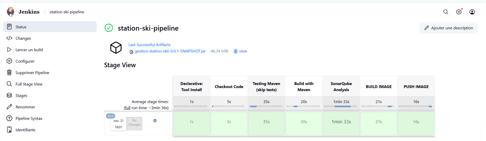
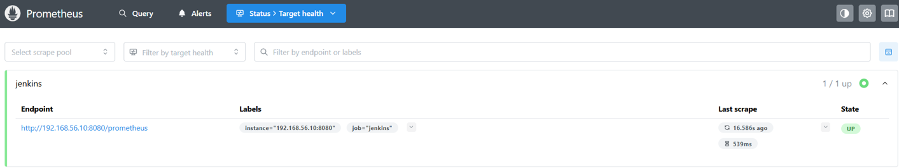
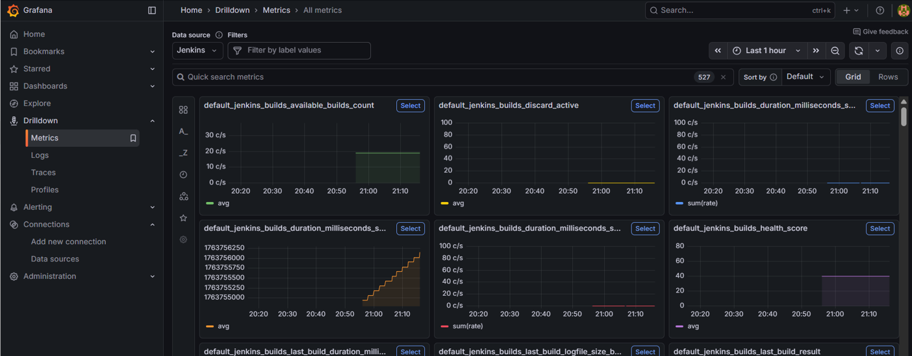

# Ski Station – DevOps CI/CD Pipeline Project
This project implements a complete DevOps pipeline for building, testing, analyzing, containerizing, and monitoring a Spring Boot application. It integrates Jenkins, Docker, SonarQube, Prometheus, and Grafana to ensure continuous integration, code quality validation, automated delivery, and real-time monitoring.

## Jenkins CI/CD Pipeline
The CI/CD pipeline is built using a Jenkins Declarative Pipeline. It automates:
- Checkout of source code from GitHub
- Installation of Maven tools
- Execution of unit tests (or optional skip)
- Static code analysis with SonarQube
- Building and packaging the Spring Boot application
- Docker image build and tagging
- Docker image push to Docker Hub

### Pipeline Stages
1. Tool Install  
2. Checkout Code  
3. Maven Test (skip tests option)  
4. Maven Build  
5. SonarQube Analysis  
6. Docker Build  
7. Docker Push  

### Jenkins Screenshot

## Docker Integration
Docker is used to containerize the Spring Boot application.  
The pipeline automatically:
- Builds a Docker image
- Tags the image
- Pushes the image to Docker Hub  
This ensures portability, consistency, and easy deployment.

## SonarQube Code Quality Analysis
SonarQube is integrated inside Jenkins to evaluate:
- Bugs
- Vulnerabilities
- Code smells
- Maintainability
- Security issues

A quality gate can be configured to fail the pipeline if the code does not meet standards.

## Prometheus Monitoring
Prometheus is used to scrape Jenkins metrics, including:
- Build duration
- Build status (success/failure)
- Jenkins system health
- CI job performance indicators

### Prometheus Screenshot

## Grafana Visualization
Grafana visualizes Prometheus metrics in real time. Dashboards show:
- Build history
- Build duration trends
- Success vs failure rates
- Health score indicators

This helps diagnose pipeline issues and monitor CI performance.

### Grafana Screenshot

## Architecture Overview
The DevOps architecture is summarized as follows:

Developer → GitHub → Jenkins → SonarQube → Docker Image → Docker Hub  
                                      ↓  
                             Prometheus Metrics  
                                      ↓  
                                   Grafana  

## Technologies Used
- Jenkins  
- Docker & Docker Hub  
- SonarQube  
- Prometheus  
- Grafana  
- Spring Boot  
- Maven  
